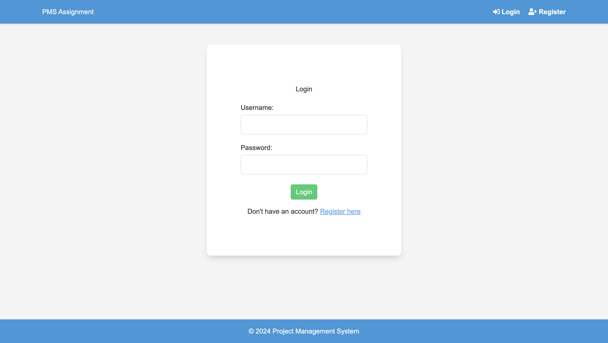
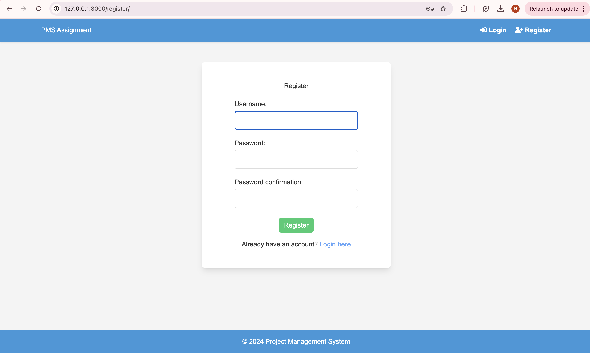
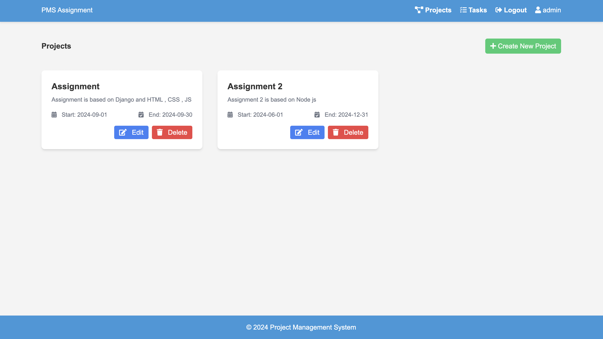
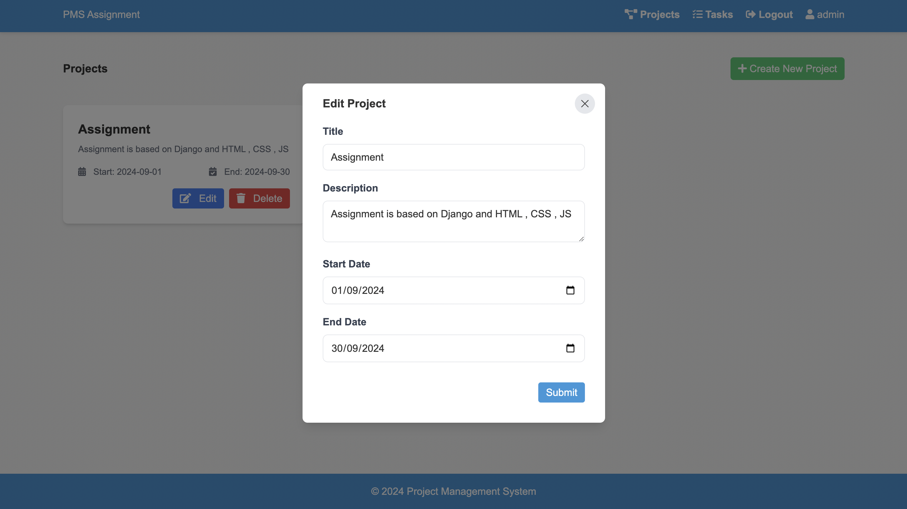
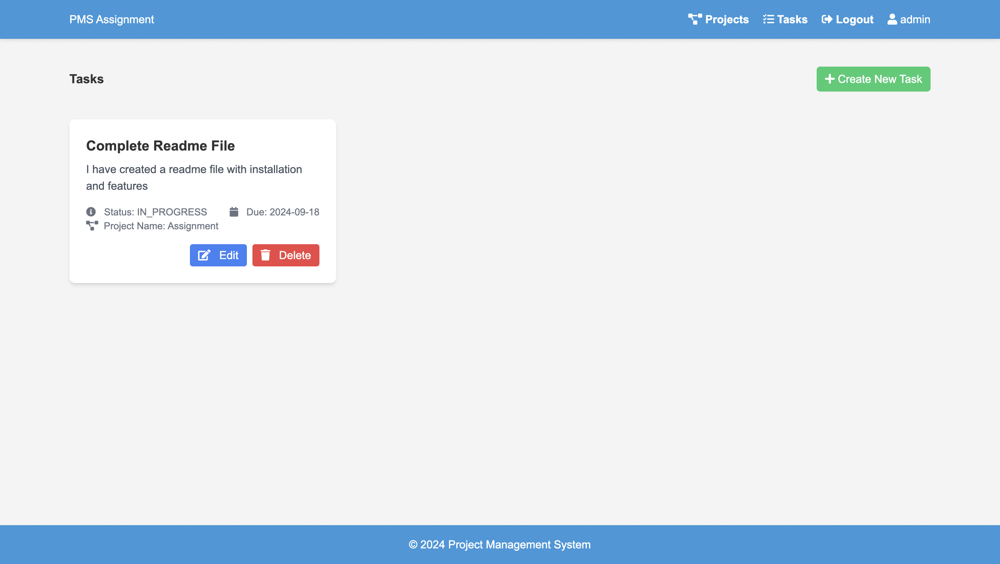
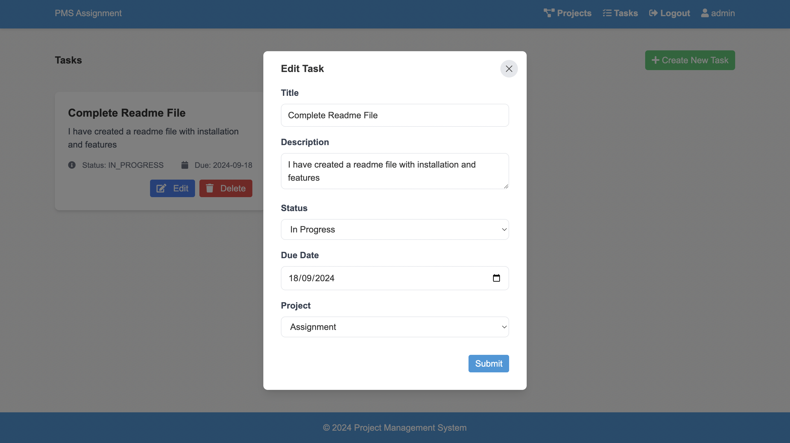
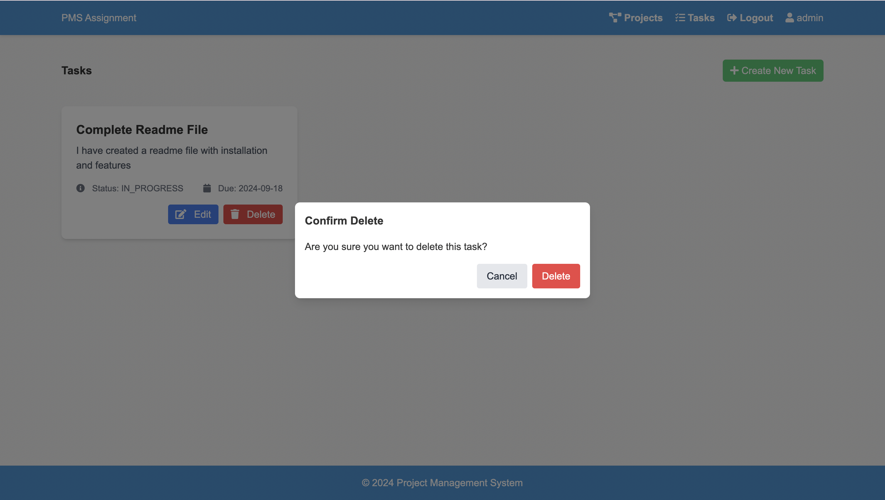
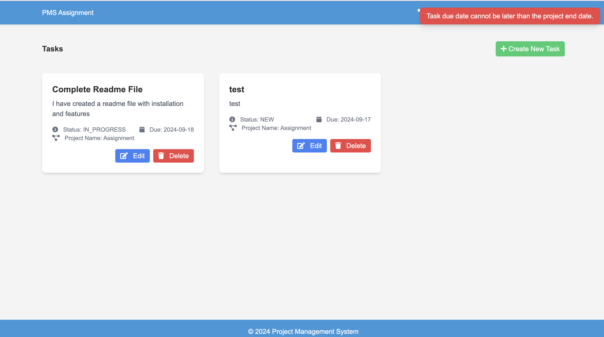

# Assignment - Project Management System

## Installation

### Create Virtual Environment

```
python3 -m venv venv
```

### Activate the Virtual Environment

```
source venv/bin/activate
```

### Install the requirements

```
pip install -r requirements.txt
```

### If you want to create a superuser

```
python manage.py createsuperuser
```

### Start the server

```
python manage.py runserver
```

### To Make migrations

```
python manage.py makemigrations
python manage.py migrate
```

## Project Functionalities

### Login Page



Default username - admin , password - admin

### Register a new User



### CRUD Operations on Projects





Similarly you can delete the project

### CRUD Operation on Tasks







### tasks error handled


